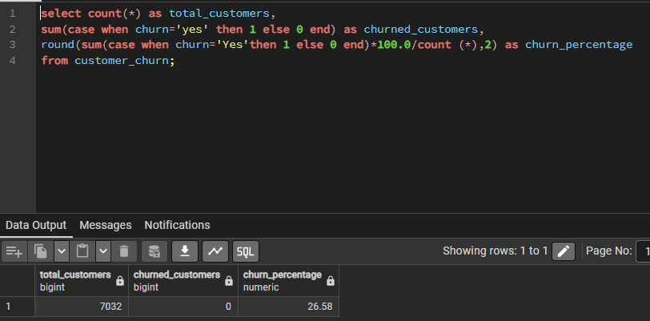
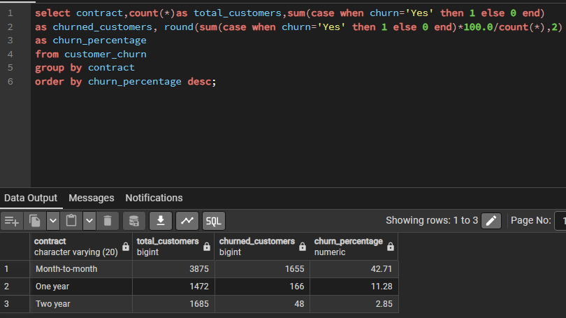
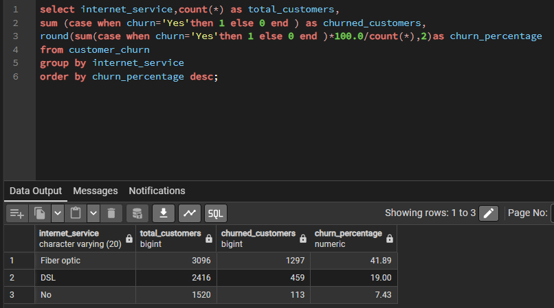
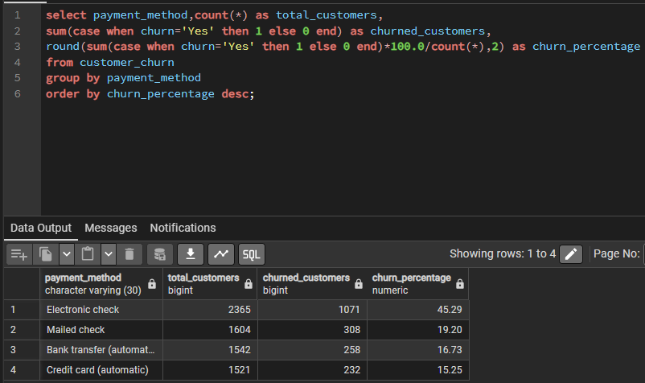
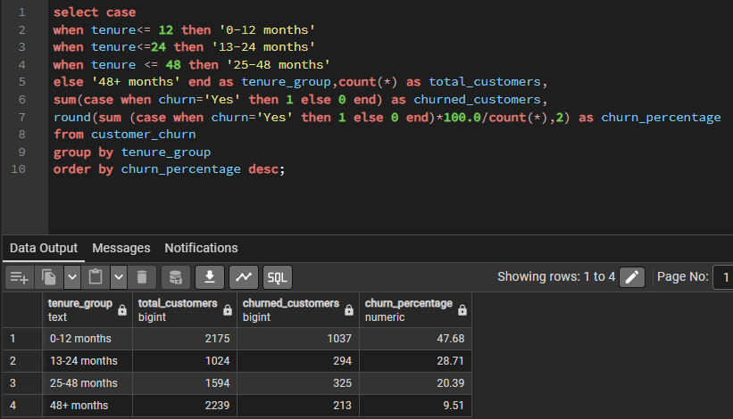
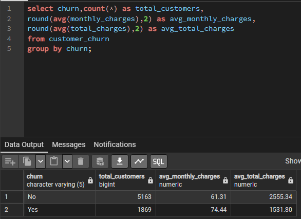

# 📊 Telco Customer Churn Analysis (SQL Project)

## 🔍 Project Objective

This project analyzes customer churn behavior using SQL in PostgreSQL.  
The objective is to identify high-risk customer segments and compare revenue patterns between churned and non-churned customers.

---

## 🛠 Tools Used

- PostgreSQL
- SQL (CASE, GROUP BY, ROUND, Aggregations)
- CSV Dataset

---

## 📊 Analysis Performed

1. Overall Churn Rate
2. Churn by Contract Type
3. Churn by Internet Service
4. Churn by Payment Method
5. Churn by Tenure Group
6. Revenue Comparison (Churn vs Non-Churn)

---

## 📈 Key Insights

- Overall churn rate is approximately **26.58%**
- Month-to-month contract customers show the highest churn (~42%)
- Fiber optic customers have higher churn compared to DSL
- Customers in the first 12 months churn the most (~47%)
- Churned customers have higher average monthly charges than non-churned customers

---

## 📸 Query Outputs

### 1️⃣ Overall Churn Rate

---

### 2️⃣ Churn by Contract Type

---

### 3️⃣ Churn by Internet Service

---

### 4️⃣ Churn by Payment Method

---

### 5️⃣ Churn by Tenure Group

---

### 6️⃣ Revenue Comparison (Churn vs Non-Churn)

---

## 💡 Business Recommendations

- Encourage customers to shift from month-to-month to long-term contracts
- Improve onboarding experience for new customers
- Investigate service issues in fiber optic segment
- Review pricing strategy for high monthly charge customers

---

## 🚀 Author

Javeed  
SQL Data Analysis Project
